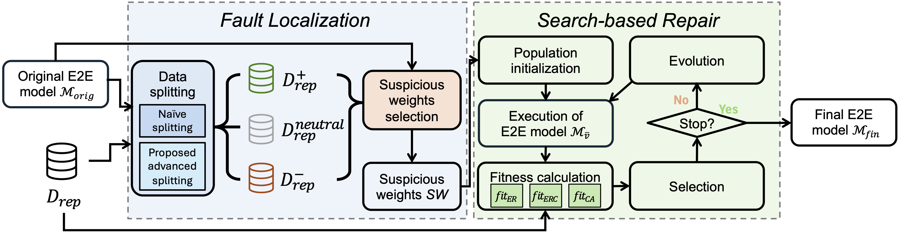

# E2ERep

This repository is for the artifact evaluation of the paper "On the Effectiveness of Open-Loop DNN Repair in End-to-End Autonomous Driving Systems", currently under review for ISSRE 2026.

## Abstract 

End-to-End (E2E) autonomous driving systems integrate perception, prediction, and planning into a unified DNN model. They have emerged as a key paradigm for the next-generation of autonomous driving. While the integrated architecture brings some benefits, these models can still make unsafe planning decisions, posing safety risks to the vehicle and other traffic participants. Once such faulty behaviors are observed, retraining the entire model is often costly and yields limited improvement. DNN repair has been proposed as a fine-grained alternative that uses a search algorithm to adjust some faulty model parameters to fix unsafe behaviors without full retraining. Inspired by these approaches, in this paper we present a practical experience report on the application of DNN repair for E2E models. In principle, during repair, the performance of each candidate repaired model should be assessed in a simulation environment (i.e., in a closed-loop manner) to check that the vehicle does not encounter any unsafe situation. However, such assessment is too costly due to the long simulation time and, so, it does not allow to repair the model in a scalable way. Therefore, in this paper, we investigate whether using open-loop metrics that check the quality of single inferences of the E2E model (which are much faster to compute) allows to effectively improve the model. To this aim, we propose a novel open-loop DNN repair approach for trajectory planning in E2E models. In the approach, we introduce a way to split repair data between correct and wrong data based on two open-loop metrics, i.e., L2 error and number of collisions. Moreover, we introduce three alternative fitness functions that make use of the two open-loop metrics in the assessment of the candidate repaired models. The approaches have been experimented on two representative E2E architectures, i.e., UNIAD and VAD. Key lessons from experiments include: our proposed approaches can improve the models under repair in terms of open-loop performance; however, these improvements are not always reflected in improvements on closed-loop performance.




## Two Target ADSs

We choose two most representative transformer-based E2E models, UniAD and VAD, as our targets. For both models, we directly use the pretrained checkpoints provided by [Bench2Drive](https://github.com/Thinklab-SJTU/Bench2Drive).

* [UniAD](https://github.com/OpenDriveLab/UniAD)
* [VAD](https://github.com/hustvl/VAD)

## Dataset

### For open-loop repair and evaluation

To produce repair and test data, we evenly partition the official [open-loop validation dataset](./Bench2DriveZoo/data/infos/b2d_infos_val.pkl) of [Bench2Drive](https://github.com/Thinklab-SJTU/Bench2Drive), which contains 50 clips (i.e., sequences of multiple input
frames), into a repair dataset [$D_{rep}$](./Bench2DriveZoo/data/infos/b2d_infos_val_partA_25clips.pkl) and a test dataset [$D_{test}$](./Bench2DriveZoo/data/infos/b2d_infos_val_partB_25clips.pkl), with 25 clips each. After filtering out inputs with incomplete ground truth trajectories, for UniAD, we obtain 4,935 inputs for $D_{rep}$ and 6,371 inputs for $D_{test}$; for VAD, we obtain 4,685
inputs for $D_{rep}$ and 6,121 inputs for $D_{test}$.

### For closed-loop evaluation

We employ two closed-loop evaluation sets from [Bench2Drive](https://github.com/Thinklab-SJTU/Bench2Drive), which consists of routes across interactive scenarios in the ADS simulator [CARLA](https://github.com/carla-simulator/carla). Specifically, `Bench2Drive220`, introduced in the [Bench2Drive paper](https://arxiv.org/abs/2406.03877), consists of 220 routes across 44 interactive scenarios. `Dev10`, introduced in the [DriveTransformer paper](https://arxiv.org/abs/2503.07656), contains 10 representative and challenging routes sampled from `Bench2Drive220`. The routes are stored under [`leaderboard/data/`](./leaderboard/data/).
 
## Experiment Environment

We conduct all the experiments on a system with the following specifications:

* Operating System: Ubuntu 22.04 LTS
* CPU: an Intel Core i9-14900K CPU
* GPU: an NVIDIA RTX PRO 6000 Blackwell Max-Q Workstation Edition GPU
* Memory: 128GB

## Installation

Follow the steps below to install E2ERep:

* **Step 1: Clone the repository:**
    ```bash
    ## This repository is currently anonymized for review.
    git clone <URL of the GitHub repository>
    ```
* **Step 2: Create environment:**
    ```bash
    ## python3.8 is recommended
    conda create -n b2d_zoo python=3.8
    conda activate b2d_zoo
    ```
* **Step 3: Install torch:**
    ```bash
    pip install torch torchvision torchaudio --index-url https://download.pytorch.org/whl/cu118
    ```
* **Step 4: Set environment variables:**
    ```bash
    # cuda 11.8 and GCC 9.4 is strongly recommended. Otherwise, it might encounter errors.
    cd Bench2DriveZoo
    export PATH=YOUR_GCC_PATH/bin:$PATH
    export CUDA_HOME=YOUR_CUDA_PATH/
    ```
* **Step 5: Install ninja and packaging:**
    ```bash
    pip install ninja packaging
    ```
* **Step 6: Install mmcv:**
    ```bash
    pip install -v -e .
    ```
* **Step 7: Prepare pretrained weights:**
    ```bash
    # create directory ckpts
    mkdir ckpts 
    ```
    Download the pretrained weights from [here](./Bench2DriveZoo/README.md) and put all `*.pth` in the `ckpts` directory.
* **Step 8: Install CARLA for closed-loop evaluation.:**
    ```bash
    ## Ignore the line about downloading and extracting CARLA if you have already done so.
    mkdir carla
    cd carla
    wget https://carla-releases.s3.us-east-005.backblazeb2.com/Linux/CARLA_0.9.15.tar.gz
    tar -xvf CARLA_0.9.15.tar.gz
    cd Import && wget https://carla-releases.s3.us-east-005.backblazeb2.com/Linux/AdditionalMaps_0.9.15.tar.gz
    cd .. && bash ImportAssets.sh
    export CARLA_ROOT=YOUR_CARLA_PATH

    ## Important!!! Otherwise, the python environment can not find carla package
    echo "$CARLA_ROOT/PythonAPI/carla/dist/carla-0.9.15-py3.7-linux-x86_64.egg" >> YOUR_CONDA_PATH/envs/YOUR_CONDA_ENV_NAME/lib/python3.8/site-packages/carla.pth # python 3.8 works well, please set YOUR_CONDA_PATH and YOUR_CONDA_ENV_NAME
    ```
## Open-loop Repair

Open-loop repair, baseline JSON generation, and open-loop evaluation on the held-out PKL are orchestrated by [`scripts/run_experiment.py`](./scripts/run_experiment.py). Run from the repository root (not from `scripts/`).

Prerequisites: Bench2Drive-style data and info PKLs under `Bench2DriveZoo/data/` (Dataset above), checkpoints under `Bench2DriveZoo/ckpts/`, and the conda environment from Installation.

* **Paper split ($D_{rep}$ / $D_{test}$):** pass [`b2d_infos_val_partA_25clips.pkl`](./Bench2DriveZoo/data/infos/b2d_infos_val_partA_25clips.pkl) as `--repair-dataset` and [`b2d_infos_val_partB_25clips.pkl`](./Bench2DriveZoo/data/infos/b2d_infos_val_partB_25clips.pkl) as `--eval-dataset`.
* **Occupancy cache:** `--occ-output-dir` is required. It stores occupancy used when generating or reusing the baseline open-loop JSON; typical values are `baseline/UniAD/uniad_occ_cache` or `baseline/VAD/vad_occ_cache`.
* **Closed-loop flag:** use `--closed-loop-eval False` for open-loop only; set `True` after CARLA is installed (Installation step 8).
* **Fitness:** `--fitness` is `CA`, `ER`, or `ERC`; use `all` to run all three in sequence. Abbreviations are case-insensitive.

* **Example (UniAD-base):** differential evolution; adjust GPU and repair hyperparameters as needed.

    ```bash
    cd <repository-root>
    python scripts/run_experiment.py \
      --model-type UniAD \
      --model-name UniAD_base \
      --rep-method Arachne_v2 \
      --search-algo DE \
      --fitness CA \
      --repair-dataset Bench2DriveZoo/data/infos/b2d_infos_val_partA_25clips.pkl \
      --eval-dataset Bench2DriveZoo/data/infos/b2d_infos_val_partB_25clips.pkl \
      --repair-alpha 0.5 \
      --repair-layers "planning_head.reg_branch.0" \
      --repair-num-weights 26 \
      --repair-particles-multiplier 2 \
      --repair-num-iterations 20 \
      --repair-early-stop-patience 5 \
      --time-horizon 3 \
      --occ-output-dir baseline/UniAD/uniad_occ_cache \
      --eval-cuda-device 0 \
      --closed-loop-eval False
    ```

For VAD-base, use the same command with `--model-type VAD`, `--model-name VAD_base`, `--occ-output-dir baseline/VAD/vad_occ_cache`, and `--repair-layers "pts_bbox_head.ego_fut_decoder.0 pts_bbox_head.ego_fut_decoder.2"`.

* **CLI reference:**

    ```bash
    python scripts/run_experiment.py --help
    ```

* **Wrappers:** optional job scripts under `scripts/` may wrap cluster-specific paths; still run `python scripts/run_experiment.py` from the repository root unless the wrapper changes the working directory.

## Closed-loop Evaluation

* **Repository layout:** closed-loop scripts assume a Bench2Drive-style tree at the repository root. Version-controlled top-level directories include:

    ```
    <repository-root>/
    ├── assets/
    ├── assets_b2d/
    ├── baseline/
    ├── Bench2DriveZoo/
    ├── docs/
    ├── leaderboard/
    │   └── team_code/          ← agents here (or symlink; see below)
    ├── mytools/
    ├── repair_uniad/
    ├── repair_vad/
    ├── scenario_runner/
    ├── scripts/
    └── tools/
    ```

* **Agents:** add Python agents under [`leaderboard/team_code/`](./leaderboard/team_code/) (for example `your_agent.py`). Pretrained weights stay under [`Bench2DriveZoo/ckpts/`](./Bench2DriveZoo/) as in Installation. Symlink Bench2DriveZoo agents instead of copying:

    ```bash
    cd leaderboard
    mkdir -p team_code
    ln -sf ../Bench2DriveZoo/team_code/* ./team_code/
    ```

* **Run evaluations:**

    Multi-GPU: set `TASK_NUM`, `GPU_RANK_LIST`, `TASK_LIST`, `TEAM_AGENT`, and `TEAM_CONFIG`. Single GPU: run `run_evaluation_single_*.sh` and edit `BASE_ROUTES`, `TEAM_*`, and related variables at the top (for `Dev10`, point `BASE_ROUTES` at `leaderboard/data/drivetransformer_bench2drive_dev10` instead of `Bench2Drive220`; see comments in those scripts). Debug images can use a lot of disk space.

    * **Baseline UniAD:**
        ```bash
        # Multi-GPU
        bash leaderboard/scripts/run_evaluation_multi_uniad.sh

        # Single-GPU (edit script header for routes and checkpoints)
        bash leaderboard/scripts/run_evaluation_single_uniad.sh
        ```
    * **Baseline VAD:**
        ```bash
        bash leaderboard/scripts/run_evaluation_multi_vad.sh

        bash leaderboard/scripts/run_evaluation_single_vad.sh
        ```
    * **Repaired UniAD:**
        ```bash
        bash leaderboard/scripts/batch_closed_loop_eval_uniad_based_on_best_open_loop_setting.sh <EXPERIMENT_OR_PARENT_DIR>
        ```
    * **Repaired VAD:**
        ```bash
        bash leaderboard/scripts/batch_closed_loop_eval_vad_based_on_best_open_loop_setting.sh <EXPERIMENT_OR_PARENT_DIR>
        ```
        For both scripts above, see the comments at the top of each file for repaired `.pth` paths, `--routes`, `--version`, and related flags (inputs come from [`scripts/run_experiment.py`](./scripts/run_experiment.py)).

* **Visualization:** sequential frames with canbus text for debugging.

    ```
    python tools/generate_video.py -f your_rgb_folder/
    ```

* **Metric:**

    Make sure there are exactly **220** routes in your merged JSON for **Bench2Drive220**. **Failed** / **Crashed** status is also acceptable. Otherwise, the headline metrics are inaccurate.

    * [`tools/merge_route_json.py`](./tools/merge_route_json.py) builds `merged.json` from per-route JSON fragments.
    * [`tools/ability_benchmark.py`](./tools/ability_benchmark.py) reads routes from the `-f` XML (`total_routes = len(routes)`).
    * [`tools/efficiency_smoothness_benchmark.py`](./tools/efficiency_smoothness_benchmark.py) needs `metric_info` logged during evaluation (see Bench2Drive team-agent notes).

    ```bash
    # Merge eval json and get driving score and success rate
    # This script will assume the total number of routes with results is 220. If there is not enough, the missed ones will be treated as 0 score.
    python tools/merge_route_json.py -f your_json_folder/

    # Get multi-ability results (use the XML that matches the evaluated route set)
    python tools/ability_benchmark.py -f leaderboard/data/bench2drive220.xml -r your_json_folder/merged.json
    python tools/ability_benchmark.py -f leaderboard/data/drivetransformer_bench2drive_dev10.xml -r your_json_folder/merged.json

    # Get driving efficiency and driving smoothness results
    python tools/efficiency_smoothness_benchmark.py -f your_json_folder/merged.json -m your_metric_folder/
    ```

## Deal with CARLA

This part comes from Bench2Drive, but it's important to deal with some bugs caused by Carla. Thanks to the author of Bench2Drive.

- CARLA has complex dependencies and is not stable. Please check the issue section of CARLA **very carefully**.
- Use tools/clean_carla.sh frequently and multiple times. Some CARLA processes are difficult to kill. Be sure to clean_carla could avoid lots of bugs.
- In our evaluation tools, the launch of CARLA is automatic: https://github.com/Thinklab-SJTU/Bench2Drive/tree/main/leaderboard/leaderboard/leaderboard_evaluator.py#L203. But you could always start CARLA by the one single command line to debug.
- CARLA is not controlled CUDA_VISIBLE_DEVICES! It is controlled by -graphicsadapter in the command line. **Interestingly, in some machines, for some unknown reasons, -graphicsadapter=1 is not available.** For example, with 4 GPUS, it might be: GPU0 -graphicsadapter=0, GPU1  -graphicsadapter=2, GPU2 -graphicsadapter=3, GPU3  -graphicsadapter=4.
- The conflict of PORT is frequently happened. Use lsof-i:YOUR_PORT frequently to avoid conflict. Avoid use small port numbers (<10000 could be unsafe).
- *4.26.2-0+++UE4+Release-4.26 522 0 Disabling core dumps*. Only showing these two lines without termination is good. *WARNING: lavapipe is not a conformant vulkan implementation, testing use only.* is bad.
- **If you face issues, always try to start CARLA in one single line to make sure CARLA could run.** If CARLA is finished immediately, it is very possible to be related to Vulkan. *Try /usr/bin/vulkaninfo | head -n 5*
- Re-install vulkan might be helpful *sudo apt install vulkan-tools; sudo apt install vulkan-utils*  In the end, you need to make sure your vulkan is correct. We have tested *Vulkan Instance Version: 1.x WARNING: lavapipe is not a conformant vulkan implementation, testing use only.* and version 1.1/1.2/1.3 works fine.
- We find that nvidia driver version 470 is good all the time. 515 has some problems but okay. 550 has lots of bugs.
- *sleep* is important to avoid crash of CARLA. For example, https://github.com/Thinklab-SJTU/Bench2Drive/blob/main/leaderboard/leaderboard/leaderboard_evaluator.py#L207, the sleep time should be extended for slower machines. When it comes to multi-gpu evaluation, https://github.com/Thinklab-SJTU/Bench2Drive/blob/main/leaderboard/scripts/run_evaluation_multi_uniad.sh#L58, the sleep time should also be extended for slower machines.

## Acknowledgements

This project builds on prior open-source efforts; we are grateful to their authors and maintainers. In particular, we acknowledge:

* [scenario_runner](https://github.com/carla-simulator/scenario_runner)
* [Bench2Drive](https://github.com/Thinklab-SJTU/Bench2Drive)
* [leaderboard](https://github.com/carla-simulator/leaderboard)
* [UniAD](https://github.com/OpenDriveLab/UniAD)
* [VAD](https://github.com/hustvl/VAD)

Our thanks also go to everyone behind the many other libraries and tools used throughout the codebase.
